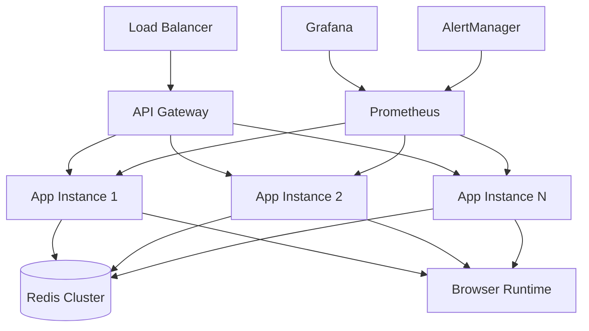

# Production Deployment Guide

## Browser Automation Service v2.0.0
**Phase 4.4d: Production Deployment Documentation**

---

## Overview

This guide provides comprehensive instructions for deploying the Browser Automation Service in production environments. The service has been enhanced with enterprise-grade reliability, monitoring, and operational features.

## Table of Contents

1. [Prerequisites](#prerequisites)
2. [Architecture Overview](#architecture-overview)
3. [Environment Setup](#environment-setup)
4. [Deployment Options](#deployment-options)
5. [Configuration](#configuration)
6. [Health Monitoring](#health-monitoring)
7. [Scaling and Performance](#scaling-and-performance)
8. [Security Considerations](#security-considerations)
9. [Troubleshooting](#troubleshooting)
10. [Operational Runbooks](#operational-runbooks)

---

## Prerequisites

### System Requirements

- **Operating System**: Linux (Ubuntu 20.04+ recommended)
- **CPU**: Minimum 4 cores, 8+ cores recommended for production
- **Memory**: Minimum 8GB RAM, 16GB+ recommended for production
- **Storage**: Minimum 50GB SSD, 100GB+ recommended
- **Network**: Reliable internet connection with low latency

### Dependencies

- **Docker**: Version 20.10+
- **Docker Compose**: Version 2.0+
- **Kubernetes**: Version 1.25+ (for K8s deployment)
- **Redis**: Version 6.0+
- **Prometheus**: Version 2.40+ (for monitoring)
- **Grafana**: Version 9.0+ (for dashboards)

### Required Accounts/Services

- **Container Registry**: Docker Hub, ECR, or similar
- **Monitoring**: Prometheus/Grafana stack
- **Alerting**: Slack/PagerDuty webhooks (optional)

---

## Architecture Overview



### Components

1. **API Layer**: FastAPI application with health checks
2. **Worker Pool**: Async workers for job processing
3. **Browser Runtime**: Playwright with Chromium
4. **Queue System**: Redis-backed job queue
5. **Monitoring**: Prometheus metrics + Grafana dashboards
6. **Reliability**: Circuit breakers, fallback systems, DLQ

---

## Environment Setup

### 1. Environment Variables

Create environment configuration files based on your deployment:

```bash
# Production Environment
cp config/production.env.example config/production.env
```

### 2. Key Configuration Variables

```env
# Core Service
DEPLOYMENT_ENVIRONMENT=production
SERVICE_PORT=8004
LOG_LEVEL=INFO

# Redis Configuration
REDIS_HOST=redis-cluster.internal
REDIS_PORT=6379
REDIS_PASSWORD=your-secure-password
REDIS_SSL=true

# Scaling Configuration
MIN_WORKERS=4
MAX_WORKERS=20
MAX_CONCURRENT_JOBS=100
JOB_TIMEOUT_SECONDS=300

# Security
API_KEY_REQUIRED=true
RATE_LIMITING_ENABLED=true
ENFORCE_HTTPS=true
CORS_ORIGINS=https://yourdomain.com

# Browser Configuration
BROWSER_HEADLESS=true
STEALTH_LEVEL=aggressive

# Monitoring
PROMETHEUS_ENABLED=true
ALERT_WEBHOOK_URL=https://hooks.slack.com/services/YOUR/WEBHOOK
```

---

## Deployment Options

### Option 1: Docker Compose (Development/Staging)

```bash
# Clone repository
git clone <repository-url>
cd browser-automation

# Build and start services
docker-compose -f docker-compose.prod.yml up -d

# Verify deployment
curl http://localhost:8004/health
```

### Option 2: Kubernetes (Production)

```bash
# Apply configurations
kubectl apply -f deployment/kubernetes.yaml

# Verify deployment
kubectl get pods -l app=browser-automation
kubectl get svc browser-automation-service

# Check health
kubectl port-forward svc/browser-automation-service 8004:8004
curl http://localhost:8004/ready
```

### Option 3: Helm Chart (Enterprise)

```bash
# Add Helm repository (if available)
helm repo add browser-automation <helm-repo-url>

# Install with custom values
helm install browser-automation browser-automation/browser-automation \
  --values values-production.yaml \
  --namespace production \
  --create-namespace

# Verify installation
helm status browser-automation -n production
```

---

## Configuration

### Production Configuration Management

The service uses a layered configuration approach:

1. **Default Values**: Built-in defaults in `src/config/production.py`
2. **Environment Variables**: Override defaults via env vars
3. **Configuration Files**: Environment-specific files in `config/`

### Critical Production Settings

```python
# Example production configuration
from src.config import get_config

config = get_config(DeploymentEnvironment.PRODUCTION)

# Security settings
config.security.api_key_required = True
config.security.rate_limiting_enabled = True
config.security.enforce_https = True

# Scaling settings
config.scaling.min_workers = 4
config.scaling.max_workers = 20
config.scaling.auto_scaling_enabled = True

# Reliability settings
config.reliability.circuit_breaker_enabled = True
config.reliability.fallback_enabled = True
config.reliability.dead_letter_queue_enabled = True
```

### Browser Security Configuration

```env
# Anti-detection settings
STEALTH_LEVEL=aggressive  # Options: basic, moderate, aggressive, paranoid

# Security features enabled at aggressive level:
# - User agent rotation
# - Canvas fingerprinting protection
# - WebGL masking
# - Timing attack protection
# - Human-like interaction patterns
```

---

## Health Monitoring

### Health Check Endpoints

The service provides multiple health check endpoints:

- **`/health`**: Basic liveness check for load balancers
- **`/ready`**: Comprehensive readiness check for K8s
- **`/health/detailed`**: Detailed component health for debugging

### Prometheus Metrics

Key metrics to monitor:

```promql
# Service availability
up{job="browser-automation"}

# Request performance
rate(http_requests_total[5m])
histogram_quantile(0.95, rate(http_request_duration_seconds_bucket[5m]))

# Job processing
rate(jobs_total[5m])
job_queue_size

# Resource usage
cpu_usage_percent
memory_usage_bytes

# Error rates
rate(errors_total[5m])
rate(external_service_errors_total[5m])

# Business metrics
rate(data_extracted_items_total[5m])
extraction_success_rate
```

### Grafana Dashboard

Import the dashboard from `monitoring/grafana-dashboard.json`:

1. Open Grafana
2. Go to "+" → Import
3. Upload `grafana-dashboard.json`
4. Configure data source (Prometheus)

---

## Scaling and Performance

### Horizontal Scaling

**Kubernetes HPA:**
```yaml
apiVersion: autoscaling/v2
kind: HorizontalPodAutoscaler
metadata:
  name: browser-automation-hpa
spec:
  scaleTargetRef:
    apiVersion: apps/v1
    kind: Deployment
    name: browser-automation-service
  minReplicas: 3
  maxReplicas: 20
  metrics:
  - type: Resource
    resource:
      name: cpu
      target:
        type: Utilization
        averageUtilization: 70
```

**Manual Scaling:**
```bash
# Scale to 10 replicas
kubectl scale deployment browser-automation-service --replicas=10

# Verify scaling
kubectl get pods -l app=browser-automation
```

### Performance Tuning

**Worker Pool Configuration:**
```env
# Adjust based on load patterns
MIN_WORKERS=4          # Minimum always-on workers
MAX_WORKERS=20         # Maximum during peak load
MAX_CONCURRENT_JOBS=100 # Queue capacity

# Resource-based scaling thresholds
CPU_SCALE_UP_THRESHOLD=0.8    # Scale up at 80% CPU
CPU_SCALE_DOWN_THRESHOLD=0.3  # Scale down at 30% CPU
MEMORY_SCALE_UP_THRESHOLD=0.85 # Scale up at 85% memory
```

**Browser Optimization:**
```env
# Browser pool sizing
BROWSER_POOL_SIZE=5           # Browsers per worker
PAGE_TIMEOUT_SECONDS=30       # Page load timeout
NAVIGATION_TIMEOUT_SECONDS=30 # Navigation timeout

# Memory management
USER_DATA_PERSISTENCE=false   # Disable for memory savings
```

### Resource Requirements

**Per Instance:**
- CPU: 1-2 cores
- Memory: 2-4GB RAM
- Storage: 10GB (logs and temporary data)

**Recommended Cluster:**
- 3-5 instances minimum for HA
- Load balancer with health checks
- Dedicated Redis cluster

---

## Security Considerations

### Network Security

```yaml
# Kubernetes Network Policy
apiVersion: networking.k8s.io/v1
kind: NetworkPolicy
metadata:
  name: browser-automation-network-policy
spec:
  podSelector:
    matchLabels:
      app: browser-automation
  policyTypes:
  - Ingress
  - Egress
  ingress:
  - from:
    - namespaceSelector:
        matchLabels:
          name: monitoring
  egress:
  - to:
    - namespaceSelector:
        matchLabels:
          name: redis
```

### Application Security

**API Security:**
```env
API_KEY_REQUIRED=true
RATE_LIMITING_ENABLED=true
RATE_LIMIT_PER_MINUTE=60
ENFORCE_HTTPS=true
```

**Browser Security:**
```env
# Sandbox security
BROWSER_HEADLESS=true
DISABLE_WEB_SECURITY=false  # Keep security enabled in production

# Anti-detection (helps avoid blocking)
STEALTH_LEVEL=aggressive
```

### Secrets Management

Use Kubernetes secrets or external secret management:

```bash
# Create Redis password secret
kubectl create secret generic redis-password \
  --from-literal=password=your-secure-password

# Create API key secret
kubectl create secret generic api-keys \
  --from-literal=api-key=your-api-key
```

---

## Troubleshooting

### Common Issues

**1. Service Won't Start**
```bash
# Check logs
kubectl logs -l app=browser-automation --tail=100

# Common causes:
# - Redis connection failed
# - Browser runtime initialization failed
# - Invalid configuration
```

**2. High Memory Usage**
```bash
# Check browser contexts
curl http://localhost:8004/health/detailed

# Possible solutions:
# - Reduce BROWSER_POOL_SIZE
# - Enable context cleanup
# - Scale horizontally instead of vertically
```

**3. Jobs Timing Out**
```bash
# Check job queue
curl http://localhost:8004/stats

# Increase timeouts:
JOB_TIMEOUT_SECONDS=600
PAGE_TIMEOUT_SECONDS=60
```

**4. External Service Errors**
```bash
# Check circuit breaker status
curl http://localhost:8004/circuit-breakers

# Review stealth configuration:
STEALTH_LEVEL=paranoid  # Maximum anti-detection
```

### Debug Commands

```bash
# Service health
curl http://localhost:8004/health/detailed | jq

# Worker status
curl http://localhost:8004/stats | jq

# Circuit breaker status
curl http://localhost:8004/circuit-breakers | jq

# Fallback system status
curl http://localhost:8004/fallback/health | jq

# Dead letter queue
curl http://localhost:8004/dlq/stats | jq

# Stealth system status
curl http://localhost:8004/stealth/status | jq
```

---

## Operational Runbooks

### Daily Operations

**Morning Health Check:**
1. Check Grafana dashboard for overnight alerts
2. Verify service health: `curl /health`
3. Check queue size and processing rate
4. Review error rates and success metrics

**Monitoring Checklist:**
- [ ] Service availability > 99.9%
- [ ] Response time p95 < 5 seconds
- [ ] Error rate < 1%
- [ ] Queue size < 50 jobs
- [ ] Memory usage < 80%
- [ ] CPU usage < 70%

### Weekly Operations

**Performance Review:**
1. Analyze weekly performance trends
2. Review scaling patterns and adjust HPA
3. Check for memory leaks or resource creep
4. Update monitoring thresholds if needed

**Security Review:**
1. Review access logs for anomalies
2. Check stealth system effectiveness
3. Verify certificate expiration dates
4. Review and rotate API keys if needed

### Incident Response

**Critical Alert Response:**
1. **Service Down**: Check pod status, restart if needed
2. **High Error Rate**: Check external service status, enable fallback
3. **Memory/CPU Critical**: Scale horizontally, check for leaks
4. **Queue Backlog**: Increase worker count, check processing

**Escalation Procedures:**
1. **L1**: Basic health checks and restarts
2. **L2**: Deep dive analysis, configuration changes
3. **L3**: Code-level debugging, emergency patches

### Maintenance Procedures

**Deployment Updates:**
```bash
# Rolling update
kubectl set image deployment/browser-automation-service \
  browser-automation=browser-automation:v2.1.0

# Monitor rollout
kubectl rollout status deployment/browser-automation-service

# Rollback if needed
kubectl rollout undo deployment/browser-automation-service
```

**Database Maintenance:**
```bash
# Redis cluster maintenance
# 1. Ensure multiple Redis instances
# 2. Perform maintenance one node at a time
# 3. Monitor queue processing during maintenance
```

**Log Rotation:**
```bash
# Configure log rotation
# Set up logrotate or use Kubernetes log rotation
# Monitor log storage usage
```

---

## Support and Contacts

### Emergency Contacts
- **On-call Engineer**: [phone/slack]
- **Team Lead**: [contact info]
- **Infrastructure Team**: [contact info]

### Resources
- **Documentation**: [wiki/confluence link]
- **Monitoring**: [grafana dashboard links]
- **Logs**: [log aggregation system links]
- **Code Repository**: [github/gitlab links]

### Support Channels
- **Slack**: #browser-automation-support
- **Email**: browser-automation-team@company.com
- **Jira**: [project key] for bug reports

---

*This document should be reviewed and updated quarterly or after major releases.*